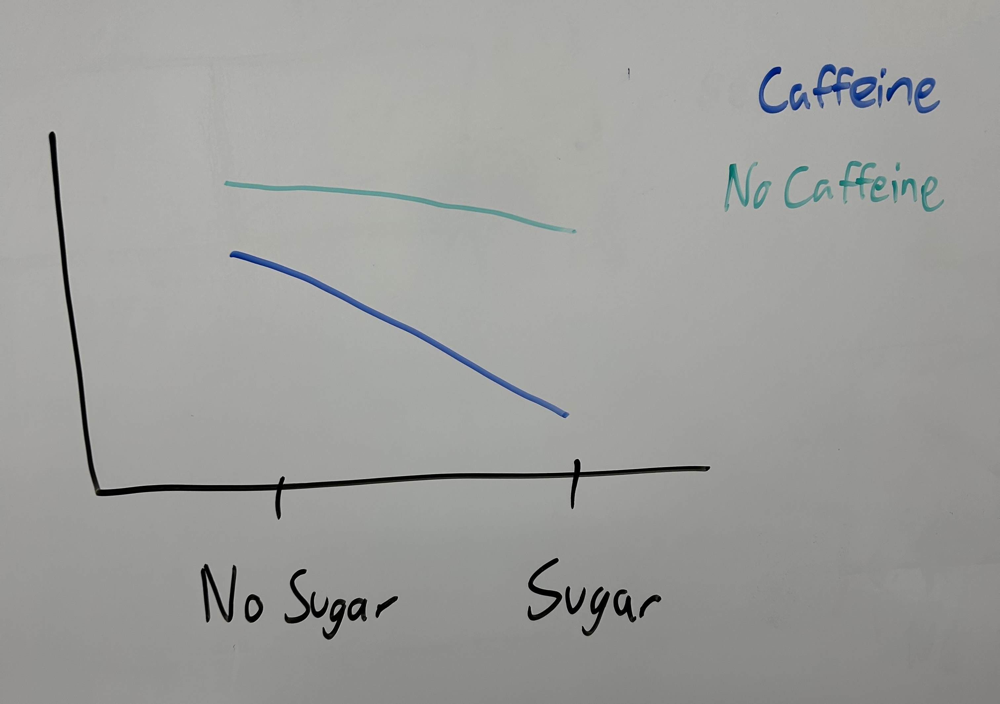

#### Created 4/7/25

#### Note - Some of the code chunks I provide will run loops of code for up to 10,000 attempts. For speed, the code provided by ChatGPT will not run. If you would like for it to run, you need to change eval to TRUE.


```{r libaries, include = FALSE}
library(tidyverse) 
```

In the process of creating Portfolio 8, I came across some trouble getting the results I wanted. As a reminder, the problem was to create simulated data for a 2(Yes/No Sugar) x 2(Yes/No Caffeine) ANOVA, with perceived distance as the dependent variable. In an ideal world, I wanted there to be a main effect of caffeine (caffeine decreased perceived distance), no main effect of sugar, and an interaction, such that the combination of both sugar and caffeine exponentially decreased perceived distance.

Here is a crude graph depicting what I was looking to create:

 <br/>

Ultimately I got close, but the green line had a positive slope, indicating adding sugar actually increased perceived distance. I decided to ask ChatGPT if it had any suggestions. I am going to include my questions asked, it's response/suggested code, my evaluation of the code, etc.


## The inital ask

I began by providing chatGPT the context, my problem, and the R markdown file for Portfolio 8 (https://github.com/eganba23/Portfolio_8). Here is is my question:

#### I am trying to create data for a lab. It is a 2x2 design, with  two IVs, sugar and caffeine, and the dv is distance. I am attaching the R file I have used. I want there to be a significant main effect of caffeine and interaction, but no main effect of sugar. I need for going from no sugar to sugar to always decrease, but in a non-significant way. 

ChatGPT responded with a brief summary of my ask and defined out the terms. It suggested this mean structure and the effects:

```{r suggested structure, message = FALSE, echo = FALSE}
library(kableExtra)

suggestion_dataframe <- data.frame(
                  Sugar = c("No", "Yes", "No", "Yes"),
                  Caffeine = c("No", "No", "Yes","Yes"),
                  Mean_Distance = c(50, 48, 60, 56),
                  Effect = c(" ", "(small drop)", "(big jump)", "(smaller jump)"))

kable(suggestion_dataframe, row.names = F) %>%
     column_spec (1:4, border_left = T, border_right = T) %>% 
     kable_styling()

```

It suggested the setup provided a main effect of caffeine, a slight drop with sugar in both levels, and an interaction. I knew it didn't acknowledge that I wanted sugar to be non-significant, so I replied:

#### Sorry. I need the main effect of caffeine to be adding caffeine decrease distance scores. The interaction would mean that the combination of sugar and caffeine reduced scores the most


It then understood that I did not want a main effect for sugar. It suggested these means:
```{r updated suggested structure, echo = FALSE}
suggestion_dataframe <- data.frame(
                  Sugar = c("No", "Yes", "No", "Yes"),
                  Caffeine = c("No", "No", "Yes","Yes"),
                  Mean_Distance = c(50, 48, 45, 40),
                  Effect = c(" ", "(small drop)", "(big drop from 50)", "(even bigger drop from 48)"))

kable(suggestion_dataframe, row.names = F) %>%
     column_spec (1:4, border_left = T, border_right = T) %>% 
     kable_styling()

```


It suggested the setup provided a strong negative main effect of caffeine, sugar slightly lowers scores in both caffeine conditions (so consistent, but subtle), and an interaction.


I told it their specifications were wonderful, and I wanted the code.

## The first code

ChatGPT provided me with it's first iteration of the code below:

```{r first chat code, message=FALSE, eval = FALSE, warning=FALSE}

set.seed(123)  # for reproducibility
library(tidyverse)
library(ggplot2)
library(emmeans)

# Number of participants per condition
n_per_cell <- 30

# Define means to create the desired effects
means <- tibble(
  sugar = rep(c("No", "Yes"), each = 2),
  caffeine = rep(c("No", "Yes"), times = 2),
  mean_distance = c(50, 45, 48, 40),  # NoS/NoC, NoS/YesC, YesS/NoC, YesS/YesC
  sd = 5
)

# Generate the dataset
sim_data <- means %>%
  rowwise() %>%
  mutate(
    distance = list(rnorm(n_per_cell, mean = mean_distance, sd = sd)),
    participant = list(1:n_per_cell)
  ) %>%
  unnest(c(distance, participant)) %>%
  mutate(
    sugar = factor(sugar, levels = c("No", "Yes")),
    caffeine = factor(caffeine, levels = c("No", "Yes"))
  )


# Fit ANOVA model
model <- aov(distance ~ sugar * caffeine, data = sim_data)
summary(model)

# Plot the interaction
ggplot(sim_data, aes(x = caffeine, y = distance, fill = sugar)) +
  stat_summary(fun = mean, geom = "bar", position = position_dodge(.9)) +
  stat_summary(fun.data = mean_se, geom = "errorbar", width = .2,
               position = position_dodge(.9)) +
  labs(title = "Interaction of Sugar and Caffeine on Distance",
       y = "Distance", x = "Caffeine") +
  theme_minimal()
```

The idea is basic. They identify the number of participants per group and create the means of each group. From there, they simulate the data based on the suggested group mean and a sd of 5 using rnorm. They expand the list-column into rows and columns, use aov() to test the data with a factorial ANOVA, and then plot the results.

This almost worked, as there was a main effect for sugar. I told chat GPT this, and they suggested to alter the means where sugar was present.

```{r chat second suggestion, message=FALSE, warning=FALSE}

set.seed(123)
library(tidyverse)
library(ggplot2)
library(emmeans)

n_per_cell <- 30

# Define revised means: smaller sugar effect
means <- tibble(
  sugar = rep(c("No", "Yes"), each = 2),
  caffeine = rep(c("No", "Yes"), times = 2),
  mean_distance = c(50, 45, 49, 43.5),  # adjusted sugar effect
  sd = 5
)

sim_data <- means %>%
  rowwise() %>%
  mutate(
    distance = list(rnorm(n_per_cell, mean = mean_distance, sd = sd)),
    participant = list(1:n_per_cell)
  ) %>%
  unnest(c(distance, participant)) %>%
  mutate(
    sugar = factor(sugar, levels = c("No", "Yes")),
    caffeine = factor(caffeine, levels = c("No", "Yes"))
  )

model <- aov(distance ~ sugar * caffeine, data = sim_data)
summary(model)

# Plot the interaction
ggplot(sim_data, aes(x = caffeine, y = distance, fill = sugar)) +
  stat_summary(fun = mean, geom = "bar", position = position_dodge(.9)) +
  stat_summary(fun.data = mean_se, geom = "errorbar", width = .2,
               position = position_dodge(.9)) +
  labs(title = "Interaction of Sugar and Caffeine on Distance",
       y = "Distance", x = "Caffeine") +
  theme_minimal()
```

By changing the means of the yes sugar groups, Chat managed to get the main effect of sugar to be less significant. Unfortunately, the interaction became non-significant. I knew at this point I could keep going back and forth, or I could alter my request.

## Creating loops to find the dataset

At this point, I told chat I needed for sugar to be non-significant. 

#### I want you to randomize values to ensure sugar is non-significant. This should not be at the expense of a significant main effect of caffeine (presence of caffeine decreases distance) and a significant interaction (the combination of caffeine and sugar further decreases distance)

This way, it would ensure:

✅ Caffeine has a significant main effect (decreases distance)

✅ There’s a significant interaction (caffeine + sugar decreases the most)

❌ Sugar is not significant, but still shows a consistent small decrease


Chat GPT told me that it would "solve this by simulating repeatedly until the ANOVA gives the pattern of significance you're looking for. Here's the updated R chunk that automatically resamples until it finds a dataset that matches your criteria"

I never thought about creating a loop, repeatedly sampling until I got what I needed. Here is what chat provided.

```{r loop inital failure, message=FALSE, eval = FALSE, warning=FALSE}

set.seed(123)
library(tidyverse)
library(ggplot2)
library(emmeans)

n_per_cell <- 30
max_tries <- 1000

# Fixed condition means (subtle sugar effect)
means <- tibble(
  sugar = rep(c("No", "Yes"), each = 2),
  caffeine = rep(c("No", "Yes"), times = 2),
  mean_distance = c(50, 45, 49, 43.5),  # No/No, No/Yes, Yes/No, Yes/Yes
  sd = 5
)

success <- FALSE
attempt <- 1

while (!success && attempt <= max_tries) {
  sim_data <- means %>%
    rowwise() %>%
    mutate(
      distance = list(rnorm(n_per_cell, mean = mean_distance, sd = sd)),
      participant = list(1:n_per_cell)
    ) %>%
    unnest(c(distance, participant)) %>%
    mutate(
      sugar = factor(sugar, levels = c("No", "Yes")),
      caffeine = factor(caffeine, levels = c("No", "Yes"))
    )

  model <- aov(distance ~ sugar * caffeine, data = sim_data)
  results <- summary(model)[[1]]

  p_sugar <- results["sugar", "Pr(>F)"]
  p_caffeine <- results["caffeine", "Pr(>F)"]
  p_interaction <- results["sugar:caffeine", "Pr(>F)"]

  if (p_sugar > 0.05 && p_caffeine < 0.05 && p_interaction < 0.05) {
    success <- TRUE
    cat("Success on attempt", attempt, "\n")
  } else {
    attempt <- attempt + 1
  }
}

if (!success) stop("Couldn't find suitable data after", max_tries, "tries.")

# Show ANOVA table
summary(model)

# Plot the interaction
ggplot(sim_data, aes(x = caffeine, y = distance, fill = sugar)) +
  stat_summary(fun = mean, geom = "bar", position = position_dodge(.9)) +
  stat_summary(fun.data = mean_se, geom = "errorbar", width = .2,
               position = position_dodge(.9)) +
  labs(title = "Interaction of Sugar and Caffeine on Distance",
       y = "Distance", x = "Caffeine") +
  theme_minimal()
```

Here, it still defined group means. What changed was that it placed the rnrom and dataset generation into a while() loop, providing if statements to continue creating samples and testing the ANOVA until it found the correct p values. 

This code broke down, as there were conditions in which the simulation leads to degenerate data (e.g., zero variance in a condition).

ChatGPT added  a check to make sure the ANOVA table includes all expected rows before trying to pull p-values, and skipped iterations if something weird happens.

```{r one thousand loop, message=FALSE, eval = FALSE, warning=FALSE}

set.seed(123)
library(tidyverse)
library(ggplot2)
library(emmeans)

n_per_cell <- 30
max_tries <- 1000

# Target means (small sugar effect)
means <- tibble(
  sugar = rep(c("No", "Yes"), each = 2),
  caffeine = rep(c("No", "Yes"), times = 2),
  mean_distance = c(50, 45, 49, 43.5),
  sd = 5
)

success <- FALSE
attempt <- 1

while (!success && attempt <= max_tries) {
  sim_data <- means %>%
    rowwise() %>%
    mutate(
      distance = list(rnorm(n_per_cell, mean = mean_distance, sd = sd)),
      participant = list(1:n_per_cell)
    ) %>%
    unnest(c(distance, participant)) %>%
    mutate(
      sugar = factor(sugar, levels = c("No", "Yes")),
      caffeine = factor(caffeine, levels = c("No", "Yes"))
    )

  model <- tryCatch(
    aov(distance ~ sugar * caffeine, data = sim_data),
    error = function(e) NULL
  )

  if (!is.null(model)) {
    results <- summary(model)[[1]]
    if (all(c("sugar", "caffeine", "sugar:caffeine") %in% rownames(results))) {
      p_sugar <- results["sugar", "Pr(>F)"]
      p_caffeine <- results["caffeine", "Pr(>F)"]
      p_interaction <- results["sugar:caffeine", "Pr(>F)"]

      if (!any(is.na(c(p_sugar, p_caffeine, p_interaction))) &&
          p_sugar > 0.05 && p_caffeine < 0.05 && p_interaction < 0.05) {
        success <- TRUE
        cat("✅ Success on attempt", attempt, "\n")
      }
    }
  }

  attempt <- attempt + 1
}

if (!success) stop("❌ Couldn't find suitable data after ", max_tries, " tries.")

# Show ANOVA results
summary(model)

# Plot interaction
ggplot(sim_data, aes(x = caffeine, y = distance, fill = sugar)) +
  stat_summary(fun = mean, geom = "bar", position = position_dodge(.9)) +
  stat_summary(fun.data = mean_se, geom = "errorbar", width = .2,
               position = position_dodge(.9)) +
  labs(title = "Interaction of Sugar and Caffeine on Distance",
       y = "Distance", x = "Caffeine") +
  theme_minimal()
```

It used tryCatch() to identify errors and warnings in the ANOVA. Interesting things I've noted is that they use an exclamation point to indicate if criteria isn't met. They also use nested if() statements to meet multiple conditions.

After the code didn't produce results at 1,000 attempts, I decided to increase the attempts to 10,000 (spoiler, it also didn't provide results).

## Changes after 10,000 attempts

I asked chatGPT if this was even possible. It suggested there might be unnecessary constraints, and suggested it could provide a version of the code that logs which p-values were failing each time, so you can see what’s going wrong and adjust precisely.

```{r simulate-2x2-diagnostic-logging, message=FALSE, eval = FALSE, warning=FALSE}

set.seed(123)
library(tidyverse)
library(ggplot2)
library(emmeans)

n_per_cell <- 30
max_tries <- 10000

# Adjusted means (tiny sugar effect), more noise
means <- tibble(
  sugar = rep(c("No", "Yes"), each = 2),
  caffeine = rep(c("No", "Yes"), times = 2),
  mean_distance = c(50, 45, 49.5, 43.5),  # small sugar effect
  sd = 6
)

success <- FALSE
attempt <- 1

while (!success && attempt <= max_tries) {
  sim_data <- means %>%
    rowwise() %>%
    mutate(
      distance = list(rnorm(n_per_cell, mean = mean_distance, sd = sd)),
      participant = list(1:n_per_cell)
    ) %>%
    unnest(c(distance, participant)) %>%
    mutate(
      sugar = factor(sugar, levels = c("No", "Yes")),
      caffeine = factor(caffeine, levels = c("No", "Yes"))
    )

  model <- tryCatch(
    aov(distance ~ sugar * caffeine, data = sim_data),
    error = function(e) NULL
  )

  if (!is.null(model)) {
    results <- summary(model)[[1]]
    if (all(c("sugar", "caffeine", "sugar:caffeine") %in% rownames(results))) {
      p_sugar <- results["sugar", "Pr(>F)"]
      p_caffeine <- results["caffeine", "Pr(>F)"]
      p_interaction <- results["sugar:caffeine", "Pr(>F)"]

      if (!any(is.na(c(p_sugar, p_caffeine, p_interaction)))) {
        if (p_sugar > 0.05 && p_caffeine < 0.05 && p_interaction < 0.05) {
          success <- TRUE
          cat("✅ Success on attempt", attempt, "\n")
        } else {
          if (attempt %% 100 == 0) {
            cat("Attempt", attempt, "failed:\n")
            cat("  p_sugar      =", round(p_sugar, 4), "\n")
            cat("  p_caffeine   =", round(p_caffeine, 4), "\n")
            cat("  p_interaction=", round(p_interaction, 4), "\n")
          }
        }
      }
    }
  }

  attempt <- attempt + 1
}

if (!success) stop("❌ Couldn't find suitable data after ", max_tries, " tries.")

# Show final model summary
summary(model)

# Plot
ggplot(sim_data, aes(x = caffeine, y = distance, fill = sugar)) +
  stat_summary(fun = mean, geom = "bar", position = position_dodge(.9)) +
  stat_summary(fun.data = mean_se, geom = "errorbar", width = .2,
               position = position_dodge(.9)) +
  labs(title = "Interaction of Sugar and Caffeine on Distance",
       y = "Distance", x = "Caffeine") +
  theme_minimal()
```

Spoiler alert, this didn't find a suitble value. But more importantly, it also didn't give me the p values as suggested. I asked if the code assumes I'll find a suitable dataset. Here was ChatGPT's response:

#### Ah, great point — and you’re totally right again. The current code only logs every 100th attempt if the ANOVA ran and returned usable p-values, but it doesn't track the closest ones overall, nor does it show what the best (i.e. closest-to-criteria) dataset was when it fails after all tries.

After fixing errors in the code it provided me, chat reccommended two changes.

1. Increase `sd` from 6 → 7 or 8 to increase variability <br/>
2. Increase `n_per_cell` from 30 → 40 or 50 for more statistical stability

This way, it would hopefully have more wiggle room with participants. Something I noticed when scanning through the code is that they set the seed. I asked if chat needed to set the seed, or could it randomize the seed to help maximize the probability for success. It suggested I randomly sample the seeds, and implemented the following changes below:

```{r change seed, eval = FALSE}

# Only set the seed once every N tries, or log successful seeds:
random_seed <- sample(1:1e6, 1)
set.seed(random_seed)
cat("Using seed:", random_seed, "\n")

```


```{r vary seed, message=FALSE, eval = FALSE, warning=FALSE}

library(tidyverse)
library(ggplot2)
library(emmeans)

n_per_cell <- 50
max_tries <- 10000
sd_val <- 8

means <- tibble(
  sugar = rep(c("No", "Yes"), each = 2),
  caffeine = rep(c("No", "Yes"), times = 2),
  mean_distance = c(50, 45, 49.5, 43.5),  # Sugar effect is small
  sd = sd_val
)

success <- FALSE
attempt <- 1

best_fit <- list(
  p_sugar = NA,
  p_caffeine = NA,
  p_interaction = NA,
  distance = Inf,
  model = NULL,
  data = NULL,
  seed = NA
)

score_fit <- function(p_sugar, p_caff, p_int) {
  score <- 0
  if (!is.na(p_sugar)) score <- score + abs(p_sugar - 0.5)
  if (!is.na(p_caff))  score <- score + abs(p_caff - 0.01)
  if (!is.na(p_int))   score <- score + abs(p_int - 0.01)
  return(score)
}

while (!success && attempt <= max_tries) {
  current_seed <- sample(1:1e6, 1)
  set.seed(current_seed)

  sim_data <- means %>%
    rowwise() %>%
    mutate(
      distance = list(rnorm(n_per_cell, mean = mean_distance, sd = sd)),
      participant = list(1:n_per_cell)
    ) %>%
    unnest(c(distance, participant)) %>%
    mutate(
      sugar = factor(sugar, levels = c("No", "Yes")),
      caffeine = factor(caffeine, levels = c("No", "Yes"))
    )

  model <- tryCatch(
    aov(distance ~ sugar * caffeine, data = sim_data),
    error = function(e) NULL
  )

  if (!is.null(model)) {
    results <- summary(model)[[1]]
    if (all(c("sugar", "caffeine", "sugar:caffeine") %in% rownames(results))) {
      p_sugar <- results["sugar", "Pr(>F)"]
      p_caffeine <- results["caffeine", "Pr(>F)"]
      p_interaction <- results["sugar:caffeine", "Pr(>F)"]

      if (!any(is.na(c(p_sugar, p_caffeine, p_interaction)))) {
        this_score <- score_fit(p_sugar, p_caffeine, p_interaction)
        if (this_score < best_fit$distance) {
          best_fit <- list(
            p_sugar = p_sugar,
            p_caffeine = p_caffeine,
            p_interaction = p_interaction,
            distance = this_score,
            model = model,
            data = sim_data,
            seed = current_seed
          )
        }

        if (p_sugar > 0.05 && p_caffeine < 0.05 && p_interaction < 0.05) {
          success <- TRUE
          cat("🎯 Successful attempt using seed:", current_seed, "\n")
        }
      }

      if (attempt %% 100 == 0) {
        cat("Attempt", attempt, 
            "| p_sugar:", round(p_sugar, 4),
            "| p_caff:", round(p_caffeine, 4),
            "| p_int:", round(p_interaction, 4), "\n")
      }
    }
  }

  attempt <- attempt + 1
}

if (!success) {
  cat("❌ No perfect fit found after", max_tries, "tries.\n")
  if (is.null(best_fit$model) || is.null(best_fit$data)) {
    cat("⚠️ Could not generate even one usable dataset with valid ANOVA output.\n")
  } else {
    cat("Closest match (not meeting full criteria):\n")
    cat("  Seed         =", best_fit$seed, "\n")
    cat("  p_sugar      =", round(best_fit$p_sugar, 4), "\n")
    cat("  p_caffeine   =", round(best_fit$p_caffeine, 4), "\n")
    cat("  p_interaction=", round(best_fit$p_interaction, 4), "\n")
    model <- best_fit$model
    sim_data <- best_fit$data

    print(summary(model))
    ggplot(sim_data, aes(x = caffeine, y = distance, fill = sugar)) +
      stat_summary(fun = mean, geom = "bar", position = position_dodge(.9)) +
      stat_summary(fun.data = mean_se, geom = "errorbar", width = .2,
                   position = position_dodge(.9)) +
      labs(title = paste("Best Attempt (Seed:", best_fit$seed, ")"),
           y = "Distance", x = "Caffeine") +
      theme_minimal()
  }
} else {
  # If success, show and plot
  cat("✅ You can reproduce this dataset using: set.seed(", best_fit$seed, ")\n")
  print(summary(best_fit$model))
  ggplot(best_fit$data, aes(x = caffeine, y = distance, fill = sugar)) +
    stat_summary(fun = mean, geom = "bar", position = position_dodge(.9)) +
    stat_summary(fun.data = mean_se, geom = "errorbar", width = .2,
                 position = position_dodge(.9)) +
    labs(title = paste("Successful Simulation (Seed:", best_fit$seed, ")"),
         y = "Distance", x = "Caffeine") +
    theme_minimal()
}
```

After all this, I wondered how much chatGPT was changing the means? I was thinking that allowing the means  to fluctuate between 100 and 500 could make a small (yet hopefully impactful) difference.

Here was the final variation it provided me:

```{r final simulation, message=FALSE, eval = FALSE, warning=FALSE}

library(tidyverse)
library(ggplot2)
library(emmeans)

n_per_cell <- 50
max_tries <- 10000
sd_val <- 15  # You can increase this if needed for more realism

success <- FALSE
attempt <- 1

best_fit <- list(
  p_sugar = NA,
  p_caffeine = NA,
  p_interaction = NA,
  distance = Inf,
  model = NULL,
  data = NULL,
  seed = NA
)

score_fit <- function(p_sugar, p_caff, p_int) {
  score <- 0
  if (!is.na(p_sugar)) score <- score + abs(p_sugar - 0.5)
  if (!is.na(p_caff))  score <- score + abs(p_caff - 0.01)
  if (!is.na(p_int))   score <- score + abs(p_int - 0.01)
  return(score)
}

while (!success && attempt <= max_tries) {
  current_seed <- sample(1:1e6, 1)
  set.seed(current_seed)

  # Generate fluctuating means between 100 and 500
  base <- runif(1, 300, 500)

  mean_distance <- c(
    base,                          # No sugar, No caffeine
    base - 20,                     # No sugar, Yes caffeine
    base - runif(1, 0, 3),         # Yes sugar, No caffeine (small drop)
    base - 20 - runif(1, 5, 10)    # Yes sugar, Yes caffeine (interaction)
  )

  means <- tibble(
    sugar = rep(c("No", "Yes"), each = 2),
    caffeine = rep(c("No", "Yes"), times = 2),
    mean_distance = mean_distance,
    sd = sd_val
  )

  sim_data <- means %>%
    rowwise() %>%
    mutate(
      distance = list(rnorm(n_per_cell, mean = mean_distance, sd = sd)),
      participant = list(1:n_per_cell)
    ) %>%
    unnest(c(distance, participant)) %>%
    mutate(
      sugar = factor(sugar, levels = c("No", "Yes")),
      caffeine = factor(caffeine, levels = c("No", "Yes"))
    )

  model <- tryCatch(
    aov(distance ~ sugar * caffeine, data = sim_data),
    error = function(e) NULL
  )

  if (!is.null(model)) {
    results <- summary(model)[[1]]
    if (all(c("sugar", "caffeine", "sugar:caffeine") %in% rownames(results))) {
      p_sugar <- results["sugar", "Pr(>F)"]
      p_caffeine <- results["caffeine", "Pr(>F)"]
      p_interaction <- results["sugar:caffeine", "Pr(>F)"]

      if (!any(is.na(c(p_sugar, p_caffeine, p_interaction)))) {
        this_score <- score_fit(p_sugar, p_caffeine, p_interaction)
        if (this_score < best_fit$distance) {
          best_fit <- list(
            p_sugar = p_sugar,
            p_caffeine = p_caffeine,
            p_interaction = p_interaction,
            distance = this_score,
            model = model,
            data = sim_data,
            seed = current_seed
          )
        }

        if (p_sugar > 0.05 && p_caffeine < 0.05 && p_interaction < 0.05) {
          success <- TRUE
          cat("🎯 Successful attempt using seed:", current_seed, "\n")
        }
      }

      if (attempt %% 100 == 0) {
        cat("Attempt", attempt, 
            "| p_sugar:", round(p_sugar, 4),
            "| p_caff:", round(p_caffeine, 4),
            "| p_int:", round(p_interaction, 4), "\n")
      }
    }
  }

  attempt <- attempt + 1
}

if (!success) {
  cat("❌ No perfect fit found after", max_tries, "tries.\n")
  if (is.null(best_fit$model) || is.null(best_fit$data)) {
    cat("⚠️ Could not generate even one usable dataset with valid ANOVA output.\n")
  } else {
    cat("Closest match (not meeting full criteria):\n")
    cat("  Seed         =", best_fit$seed, "\n")
    cat("  p_sugar      =", round(best_fit$p_sugar, 4), "\n")
    cat("  p_caffeine   =", round(best_fit$p_caffeine, 4), "\n")
    cat("  p_interaction=", round(best_fit$p_interaction, 4), "\n")
    model <- best_fit$model
    sim_data <- best_fit$data

    print(summary(model))
    ggplot(sim_data, aes(x = caffeine, y = distance, fill = sugar)) +
      stat_summary(fun = mean, geom = "bar", position = position_dodge(.9)) +
      stat_summary(fun.data = mean_se, geom = "errorbar", width = .2,
                   position = position_dodge(.9)) +
      labs(title = paste("Best Attempt (Seed:", best_fit$seed, ")"),
           y = "Distance", x = "Caffeine") +
      theme_minimal()
  }
} else {
  cat("✅ You can reproduce this dataset using: set.seed(", best_fit$seed, ")\n")
  print(summary(best_fit$model))
  ggplot(best_fit$data, aes(x = caffeine, y = distance, fill = sugar)) +
    stat_summary(fun = mean, geom = "bar", position = position_dodge(.9)) +
    stat_summary(fun.data = mean_se, geom = "errorbar", width = .2,
                 position = position_dodge(.9)) +
    labs(title = paste("Successful Simulation (Seed:", best_fit$seed, ")"),
         y = "Distance", x = "Caffeine") +
    theme_minimal()
}
```

At this point, I figure either the code was faulty, or this was simply an impossible task. I let chatGPT rest.